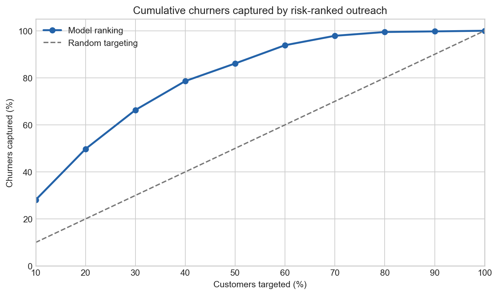
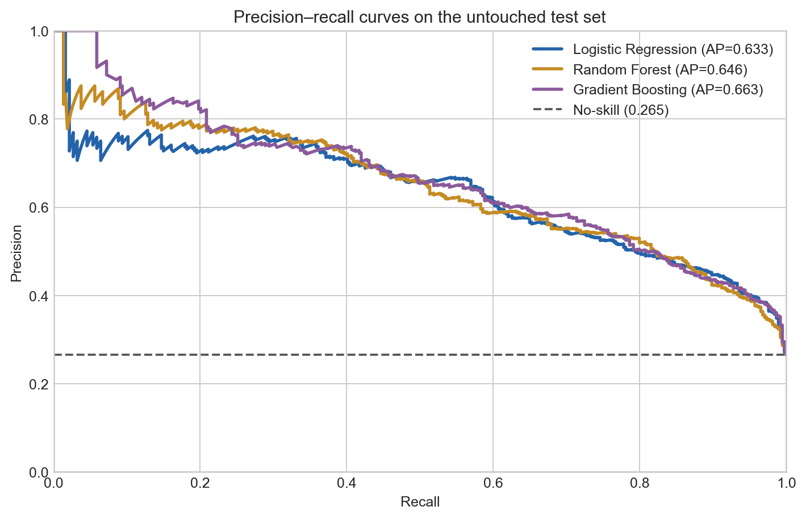
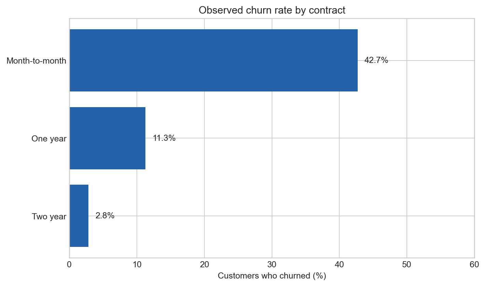
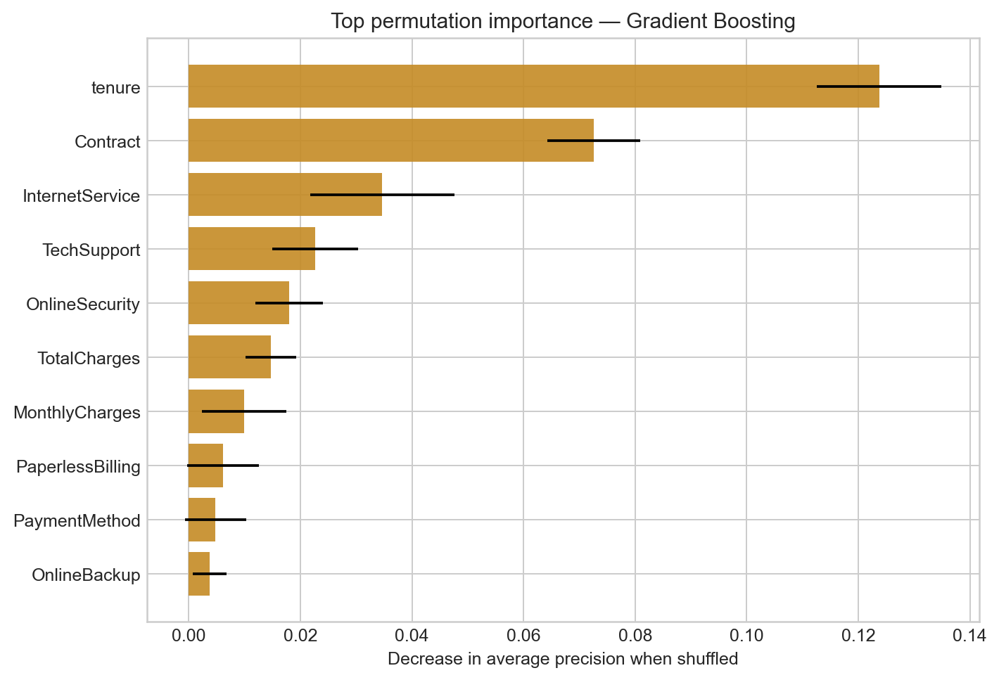

# Customer Churn Prediction

[](https://github.com/sagarmandavkar-UX/customer-churn-prediction/actions/workflows/ci.yml)
[](https://www.python.org/)
[](LICENSE)

Can machine learning identify customers most likely to stop using a service—and turn that risk score into a practical retention list?

This end-to-end classification project compares Logistic Regression, Random Forest, and Gradient Boosting on the IBM Telco Customer Churn sample. It uses leakage-safe preprocessing, out-of-fold model selection, an untouched test set, permutation importance, and outreach-capacity analysis.



## Business answer

**Gradient Boosting produced the strongest development-set average precision.** On the untouched test set:

- PR-AUC: **0.663**
- ROC-AUC: **0.845**
- Recall at the development-selected threshold: **72.5%**
- Precision at that threshold: **55.9%**
- Highest-risk 20% captured **49.7% of churners**
- Lift at a 20% outreach budget: **2.48×**

For a retention team, the useful output is not simply a predicted label. It is a ranked queue: contact the highest-risk customers first, test an appropriate offer, and measure incremental retention against a control group.

## Dataset

The project uses the [Telco Customer Churn dataset](https://www.kaggle.com/datasets/blastchar/telco-customer-churn), attributed on Kaggle to IBM Sample Data Sets:

- 7,043 fictional telecommunications customers
- 19 model inputs after removing customer ID and target
- 26.5% observed churn rate
- Subscription tenure, services, contract, billing, and payment information
- 11 blank `TotalCharges` values handled inside the model pipeline

See [data/README.md](data/README.md) for source and licensing details.

## Modeling workflow

```text
IBM telco sample
       │
       ▼
Schema, uniqueness, missing-value checks
       │
       ▼
80% development / 20% untouched test split
       │
       ├── Logistic Regression
       ├── Random Forest
       └── Gradient Boosting
       │
       ▼
5-fold out-of-fold PR-AUC model selection
       │
       ▼
Threshold selection on development predictions only
       │
       ▼
Final test evaluation + retention targeting analysis
```

Categorical encoding, numeric scaling, and missing-value imputation are fit inside each training fold. This prevents information from the validation or test rows from leaking into preprocessing.

## Results



Average precision is the primary metric because churn is the minority class. ROC-AUC is reported as a complementary ranking measure; accuracy is not used for model selection.



Month-to-month customers show the highest observed churn rate in this sample. That relationship can guide investigation, but it does not prove contract type causes churn.



Permutation importance shows which raw inputs matter most to held-out ranking performance. It measures predictive reliance—not a causal reason for customer behavior.

## Responsible use

This project is a portfolio demonstration built on a fictional IBM sample. Before real deployment, a company should validate the model on a recent time-ordered cohort, review subgroup fairness and privacy constraints, calibrate outreach costs, and run a controlled experiment to estimate whether intervention actually prevents churn.

See [MODEL_CARD.md](MODEL_CARD.md) for intended use, limitations, and monitoring requirements.

## Repository structure

```text
.
├── data/
│   ├── README.md
│   └── raw/                 # downloaded locally, not committed
├── notebooks/customer_churn_analysis.ipynb
├── reports/
│   ├── figures/
│   ├── feature_importance.csv
│   ├── model_comparison.csv
│   ├── summary.json
│   └── targeting_gains.csv
├── scripts/
├── src/churn/
├── tests/
└── MODEL_CARD.md
```

## Run locally

```bash
python -m venv .venv
source .venv/bin/activate
python -m pip install -e ".[dev]"
python scripts/download_data.py
python scripts/run_analysis.py
python scripts/build_notebook.py
jupyter nbconvert --execute --to notebook --inplace notebooks/customer_churn_analysis.ipynb
pytest -q
```

## Outputs

- [Executed analysis notebook](notebooks/customer_churn_analysis.ipynb)
- [Model card](MODEL_CARD.md)
- [Machine-readable summary](reports/summary.json)
- [Model comparison](reports/model_comparison.csv)
- [Feature importance](reports/feature_importance.csv)
- [Risk-ranked targeting gains](reports/targeting_gains.csv)

## Method note

The project brief was informed by [Customer Churn Prediction Using Machine Learning](https://medium.com/@allanouko17/customer-churn-prediction-using-machine-learning-ddf4cd7c9fd4). The implementation improves evaluation discipline by selecting models with out-of-fold predictions, keeping a final test set untouched, and reporting retention-capacity metrics in addition to classifier scores. All code, analysis, and writing in this repository are original.
